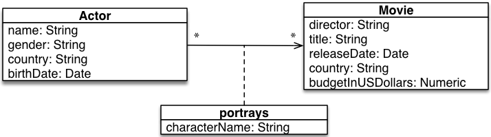

# Babel: A domain specific language for graph generation
[](https://travis-ci.org/DAMA-UPC/Babel) [](https://www.codacy.com/app/DAMA-UPC/Babel?utm_source=github.com&amp;utm_medium=referral&amp;utm_content=DAMA-UPC/Babel&amp;utm_campaign=Badge_Grade) [](https://www.codacy.com/app/DAMA-UPC/Babel?utm_source=github.com&utm_medium=referral&utm_content=DAMA-UPC/Babel&utm_campaign=Badge_Coverage)




### Add dependency:

https://bintray.com/dama-upc/Babel-Platform/babel

#### If using the SBT tool:

Add the following snippet to the `build.sbt` file:

```sbtshell
resolvers += "maven" at "https://dl.bintray.com/dama-upc/Babel-Platform"
libraryDependencies += "edu.upc.dama" %% "babel" % "0.4.0"
```

### Definition of node models

```scala
import babel._
import java.time.LocalDate

@node class Actor(name: String,
                  gender: Option[String],
                  country: String,
                  birthDate: LocalDate)
```


```scala
import babel._

@node class Movie(director: String,
                  title: String,
                  releaseDate: LocalDate,
                  country: String,
                  budgetInUSDollars: Option[Double])
```

### Definition of Edge models

```scala
import babel._
import java.time.LocalDate

@edge
class Portrayed(characterName: String)
```

### Property generators definition

```scala
import babel._

object ActorBirthDateGenerator extends PropertyGenerator[LocalDate] {

  override def run(id: Id,
                   r: (Id) => Long,
                   dependencies: Any*): LocalDate =
    LocalDateGenerator.nextLocalDate(
      hash = r(id),
      min = NOW().minusYears(90),
      max = NOW(),
      distribution = Distribution.Uniform
    )
}
```

### Defining graph structure generators.

For defining graph structure generators, we need to implement
the following interface:

```scala
trait GraphStructureGenerator[T] {
  val run(n: Long): T
  val getNumberNodes(numberEdges: Long): Long
}
```
